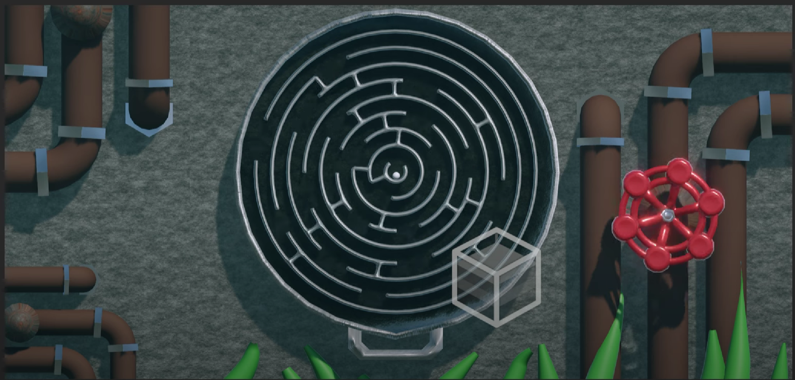

# Arduino-Installation-Project-

This project was developed as part of a university module in 2023 — an experimental, escape room-style installation. Our interdisciplinary team of three included:

Karahan - Designer & 3D Modeller.
Aidan: Artist & Electronics Specialist
Me: System & Game Prgrammer. 
Role: System & Game Programmer

I was responsible for developing the interactive puzzle logic and control system using Arduino and C++. My work focused on:

- Game state management and timing logic.
- Integration with physical components (LEDs, sensors, triggers).
- Ensuring smooth puzzle flow and user interaction.
- Basic circuit design and Arduino prototyping.

## Summary 
This was a hands-on, creative collaboration aimed at building a functional, immersive escape room experience. The final installation featured a sequence of interactive puzzles involving real-time feedback from sensors, dynamic lighting, and player-triggered events. The system was developed using C++ for Arduino, alongside basic electronics and physical computing techniques.

|<a href="https://youtu.be/yL6otRnHZ60?si=hH-IpzB_I-MKf2Hz">|
|:-|
|
 *A Youtube video of in-game sample.* 
|
